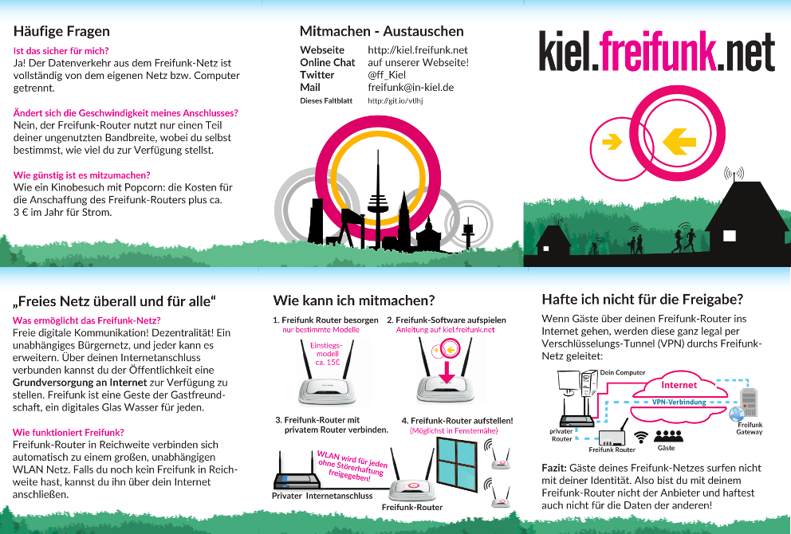

Diese Vorlage ist für die Community X angepasst, aber Ihr könnt sie gerne für eure Zwecke benutzen.

# Dateien in diesem Repository

- `flyer-6-seiten_scribus1.5/flyer_6_seiten.sla` - die Quelldatei für Scribus mit allen Ebenen für diverse Communities und zwei Text-Varianten (Du- und Sie-Form)
- `CONTENT_Business_de.md` - Die Texte in dem Flyer in der Sie-Form (als text, zum kopieren)
- `CONTENT_de.md` - Die alternativen Texte in der Du-Form
- `flyer_6_seiten.pdf` - fertige Druckvorlage für Flyer-Alarm
- `flyer_6_seiten_rueckseite_gedreht.pdf` - Druckvorlage zum selber ausdrucken auf DIN-A4
- `flyer_6_seiten_rueckseite_gedreht.xcf` - Druckvorlage zum bearbeiten mit Gimp

# Anpassen an deine Community
Um dieses Faltblatt anzupassen einfach dieses Git Repository klonen und die Frontseite und Rückseite anpassen. 

Die Quell-Datei ist `flyer-6-seiten_scribus1.5/flyer_6_seiten.sla`, für die Bearbeitung ist **Scribus 1.5** nötig (hier benutze Version: 1.5.3), dies ist unter Debian in dem paket `scribus-trunk` erhältlich, das man sich aus einem ppa installieren muss, siehe http://askubuntu.com/questions/639070

Um das Layout anzupassen muss nur der Titel auf der Frontseite geändert werden und die Rückseite. Alle anderen Seiten sind Community-unspezifish und können so bleiben wie sie sind.

Alle Quellen für den Flyer sind im Repository enthalten, also könnt ihr auch einfach weitere Änderungen einbauen.
Im Ordner `exports` ist unter anderem eine svg version, die man z.B. mit Inkskape weiterbearbeiten kann.

# Drucken

## als PDF exportieren
Beim Exportieren darauf achten:
* PDF-Version 1.5 auswählen
* Etwaige Fehler wegen leeren Textrahmen ignorieren
* Allgemein -> Höchste Auflösung ankreuzen und 600dpi Auflösung wählen (standard in Scribus ist 300dpi)
* Schriftarten -> "Outline all fonts" **sonst fehlen bei Flyer Alarm die Bindestriche!!!**

## Flyer-Alarm
Ich habe diesen Flyer erfolgreich 5000x bei Flyer-Alarm drucken lassen auf [170g Recycling-Papier ohne Veredelung](https://www.flyeralarm.com/de/shop/configurator/index/id/88/faltblaetter-wickelfalz.html#404=1527&405=1534&406=1529&407=4483&408=1550&409=1532&410=1533). Der Druck ist super geworden mit dem [flyer_6_seiten.pdf](https://github.com/rubo77/freifunk-faltblatt-6-seiten/blob/ffki/flyer_6_seiten.pdf). (Das Anforderungs-PDF von Flyer Alarm ist im Entwicklungsordner und alles Ist im richtigen Format erstellt.)

## selbst drucken
Ohne Duplex kannst du einfach das PDF `flyer_6_seiten_rueckseite_gedreht.pdf` benutzen. Dabei kann man die einseitig bedruckten Blätter so gedreht wieder in den Drucker einlegen, dass das erneute Bedrucken jeweils die passende Hälfte ergänzt und man so nur einen Schnitt in der Mitte braucht um 2 vollständige Faltblätter zu trennen.

## Druckvorlage neu erzeugen mit Gimp:
Um  das PDF `flyer_6_seiten_rueckseite_gedreht.pdf` neu zu erzeugen befolge folgende Schritte:
* in Gimp das pdf importieren **mit 600dpi**
* Leinwandgrösse verdoppeln (also bei original 2362 px Höhe auf 4724 px)
* die 2. Ebene (Innenseiten) nach unten schieben (mit STRG gedrückt)
* Die untere Ebene transformieren: um 180° drehen
* Exportieren als pdf: `flyer_6_seiten_rueckseite_gedreht.pdf`

## Prewiew png erzeugen
* in Gimp die untere Ebene wieder um 180° zurückdrehen
* Bildgröße ändern: 72dpi, 992x670 px
* exportieren als `flyer_6_seiten_preview.png`

# Fonts installieren
Die benötigten Fonts sind im Ordner `/flyer-6-seiten_scribus1.5/fonts`, in Linux kann man fonts installieren, z.b. mit:

	sudo mkdir -p ~/.fonts/truetype/minionpro
	sudo cp quellen/FF_Flyer_8seiter.indd/FF_Flyer_8seiter\ Ordner/Document\ fonts/MinionPro-Regular.otf ~/.fonts/truetype/minionpro/

# Danksagungen
Dieser Flyer ist entstanden aus einem gekürzten Text aus dem Möhne Flyer, der hier veröffentlicht wurde: 

 - https://forum.freifunk.net/t/pocket-flyer-8-seiter-jetzt-auf-betterplace-spenden/1005 
 - https://www.dropbox.com/s/kwytvedboxhw8h7/Flyer_8seiter_moehne_Druck.pdf?dl=0
 - Und Teile vom hamburger Flyer: http://www.vonbroeckel.de/download/flyer.ffhh.v08.pdf

# Übersicht über den gesamten Text:

[`CONTENT_de.md`](CONTENT_de.md)

Lizenz
------
Die Inhalte sind in der Regel unter CC-BY-SA veröffentlicht. In Ausnahmen ist dies explizit angegeben!

 This work is licensed under a <a rel="license" href="http://creativecommons.org/licenses/by-sa/4.0/">Creative Commons Attribution-ShareAlike 4.0 International License</a>.
